# 📝 Project Manager App

A beautiful, fully-functional task management application built with Flutter and Firebase. This app features a stunning "liquid glass" UI design, secure authentication, real-time cloud sync, and motivational quotes.

---

## ✨ Features

- **🔐 Secure Authentication:** Full Firebase Authentication flow including Sign Up, Login, and automatic state management.
- **☁️ Cloud Sync:** Real-time Firestore database integration for seamless CRUD operations (Create, Read, Update, Delete) on tasks.
- **✨ Liquid Glass UI:** A modern, premium user interface with a glassmorphism aesthetic and smooth micro-animations.
- **🌙 Dark/Light Mode:** Full theme support that seamlessly transitions between light and dark modes.
- **💡 Motivational Quotes:** Integrated with a REST API to provide daily inspirational quotes directly in the app.
- **📊 Profile Dashboard:** A dedicated screen to track task completion stats and focus areas.

---

## 📱 Screenshots

<div align="center">
  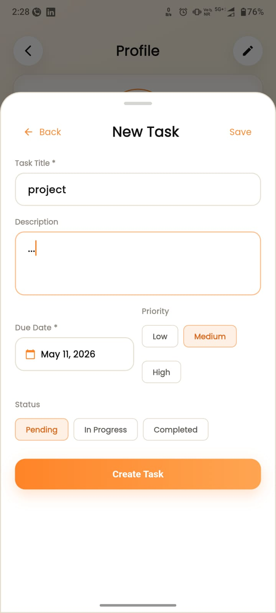
  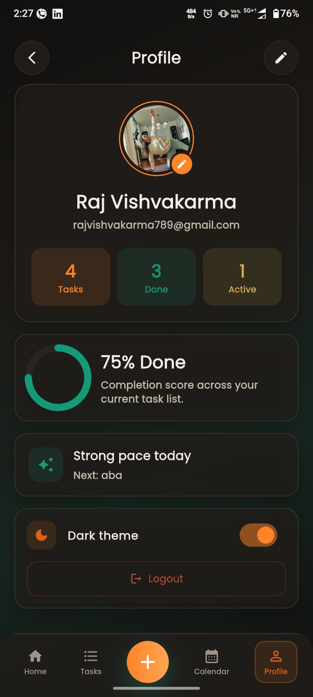
  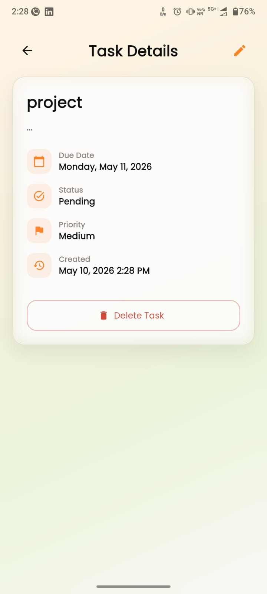
  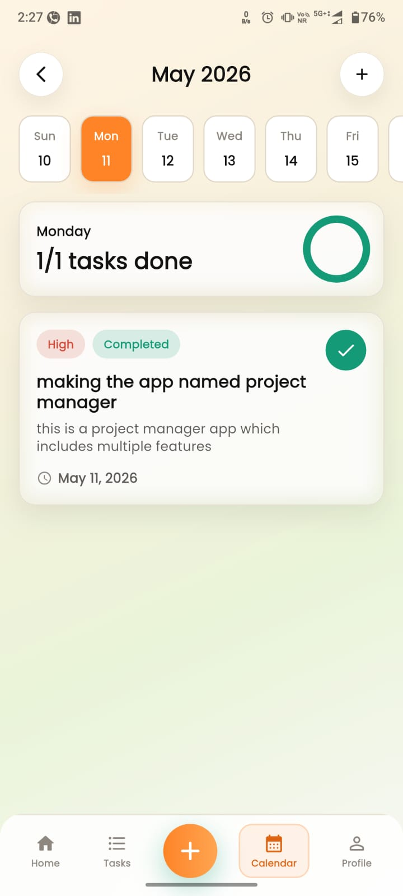
</div>
<br>
<div align="center">
  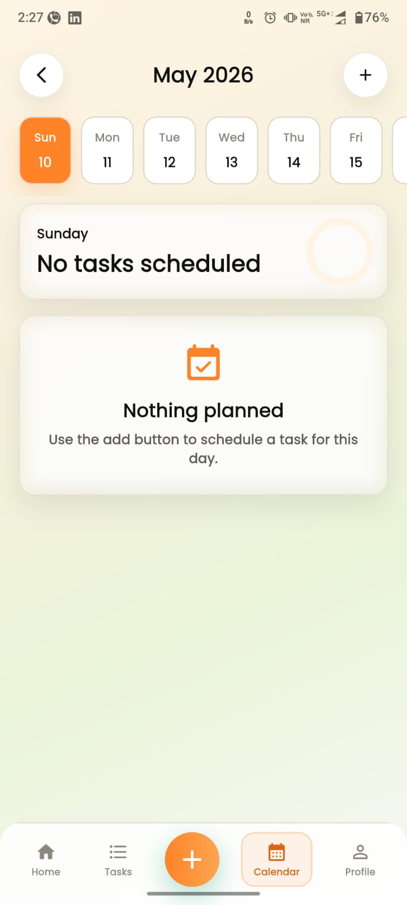
  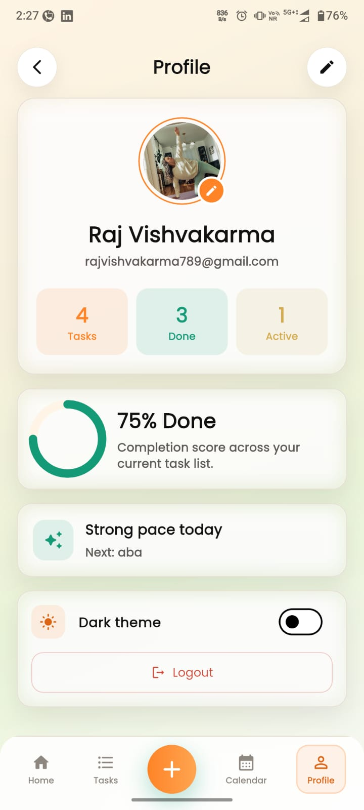
  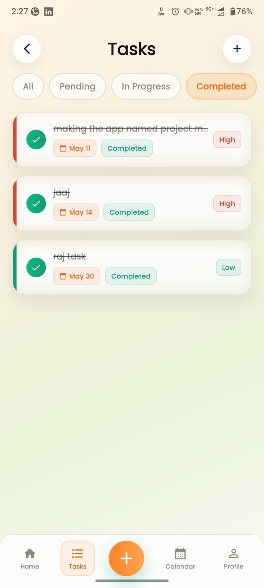
  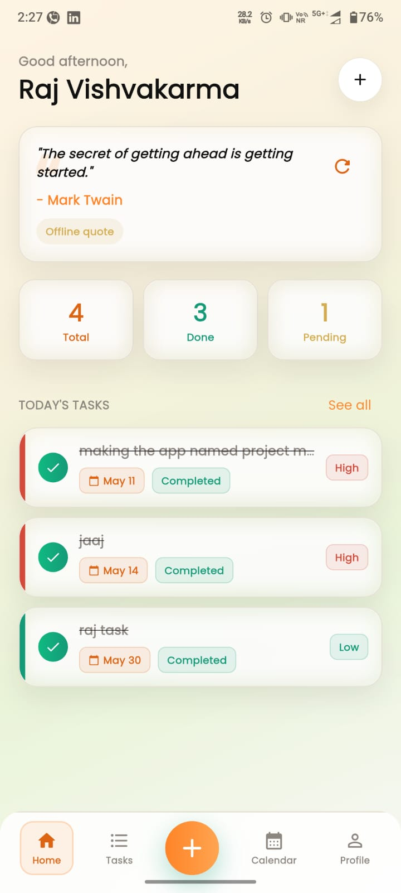
</div>
<br>
<div align="center">
  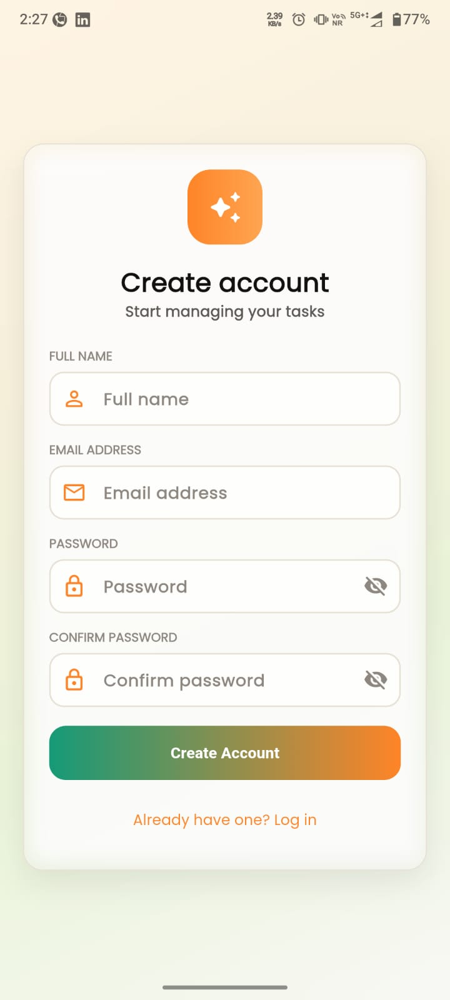
  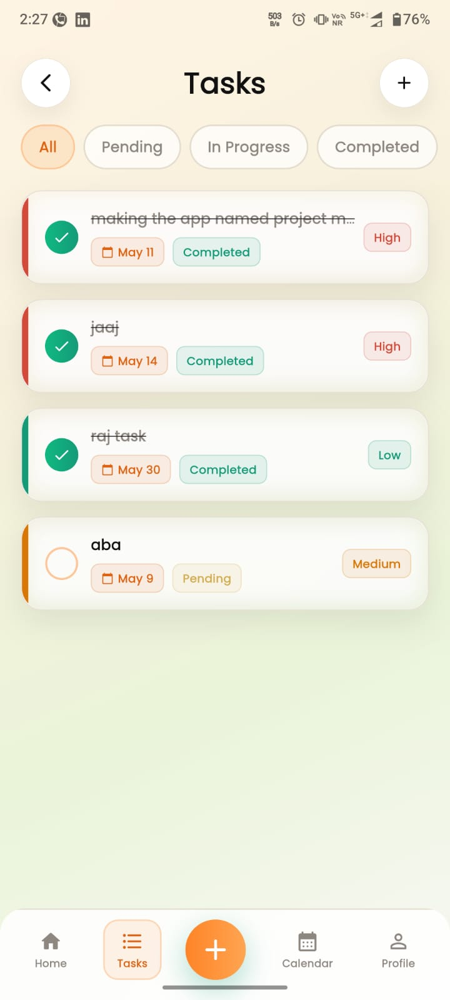
  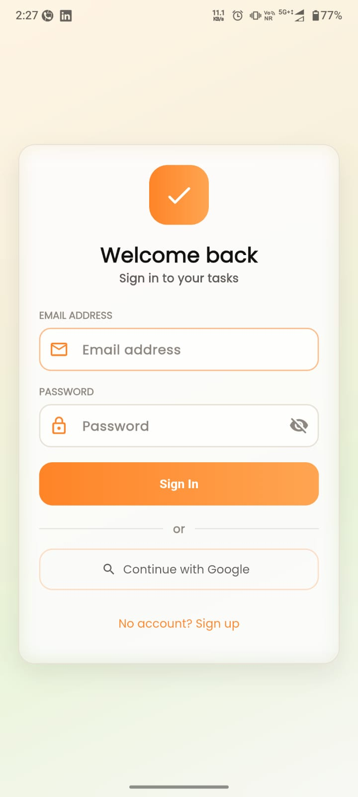
</div>

---

## 🛠 Tech Stack & Architecture

- **Framework:** Flutter (Dart)
- **Backend:** Firebase (Authentication, Cloud Firestore)
- **State Management:** `provider`
- **Architecture:** Service & Provider pattern (`Screens` -> `Providers` -> `Services` -> `Firebase/HTTP`)
- **UI/UX:** Custom glassmorphism components, `google_fonts`, `lottie` animations, `shimmer` loading effects.

---

## 🚀 Getting Started

### Prerequisites
- Flutter SDK (`^3.11.3`)
- Firebase Account

### Installation

1. **Clone the repository:**
   ```bash
   git clone https://github.com/rajvishvakarma088-star/project_manager_app.git
   cd project_manager_app
   ```

2. **Install dependencies:**
   ```bash
   flutter pub get
   ```

3. **Firebase Configuration:**
   - Create a new project in the [Firebase Console](https://console.firebase.google.com/).
   - Add an Android app with the package name: `com.example.project_manager`.
   - Download the `google-services.json` file and place it in the `android/app/` directory.
   - *Note: `google-services.json` is intentionally `.gitignore`d for security.*

4. **Enable Authentication:**
   - In your Firebase Console, navigate to **Build > Authentication**.
   - Enable the **Email/Password** sign-in method.

5. **Setup Firestore:**
   - Navigate to **Build > Firestore Database** and create a database.
   - Publish the following Security Rules (found in `firestore.rules`) to allow users to only manage their own tasks:
     ```javascript
     rules_version = '2';
     service cloud.firestore {
       match /databases/{database}/documents {
         match /users/{uid}/tasks/{taskId} {
           allow read, write: if request.auth != null && request.auth.uid == uid;
         }
       }
     }
     ```

6. **Run the App:**
   ```bash
   flutter run
   ```
